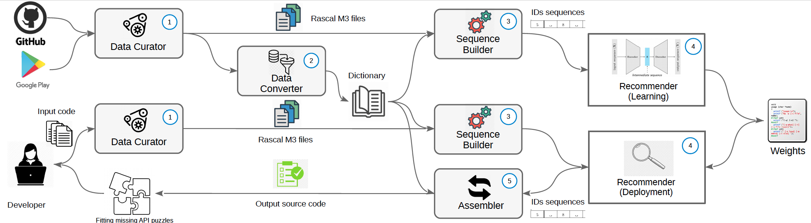

## Welcome to LUPE page
LUPE is a novel approach to API and code recommendation, exploiting cutting-edge deep learning techniques. Thanks to the underlying Encoder-Decoder architecture specialized in transforming sequences, LUPE can effectively learn the order in which APIs occur.

## LUPE Overview

The LUPE architecture is depicted in figure above. Data is fetched from various open-source sources **1** using the _DATA CURATOR_ **2** component. The collected data is then transformed into a suitable format to store in CSV files by the _DATA CONVERTER_ **3** , which then builds a universal dictionary
containing APIs and their corresponding IDs. The _SEQUENCE BUILDER_ **4** component uses the dictionary to extract APIs from Rascal M3 files. It also generates input for _RECOMMENDER_, which learns from data in the training phase to provide recommendations in the testing/deployment phase.
## Repository Structure 
This repository is organized as follows:

* The [tools](https://github.com/SANER2022-LUPE/LUPE/tree/master/tools) directory contains the implementation of the different tools we developed:
	* [GAPI](https://github.com/SANER2022-LUPE/LUPE/tree/master/tools/GAPI): The [models](https://github.com/SANER2022-LUPE/LUPE/tree/master/tools/GAPI/weight/GAPI200_2) trained from D200_BIG dataset
	* [LUPE](https://github.com/SANER2022-LUPE/LUPE/tree/master/tools/LUPE): The LUPE tool including the trained [model](https://github.com/SANER2022-LUPE/LUPE/blob/master/tools/LUPE/myModel.h5)
* The [dataset](https://github.com/SANER2022-LUPE/LUPE/tree/master/datasets) directory contains the datasets described in the paper that we use to evaluate LUPE:
	* [D200_SMALL](https://github.com/SANER2022-LUPE/LUPE/tree/master/datasets/D200_SMALL): meta-data from 200 small projects
	* [D200_BIG](https://github.com/SANER2022-LUPE/LUPE/tree/master/datasets/D200_BIG): meta-data from 200 small projects
	* [D1200](https://github.com/SANER2022-LUPE/LUPE/tree/master/datasets/D1200): meta-data from 1200 
 projects	

### Venue acronym table

| Acronym  | Venue                                                                                                           |
|----------|-----------------------------------------------------------------------------------------------------------------|
| ESEC/FSE | The ACM Joint European Software Engineering Conference and Symposium on the Foundations of Software Engineering |
| JSS      | Journal of Systems and Software                                                                                 |
| ISSRE    | International Symposium on Software Reliability Engineering                                                     |
| SANER    | IEEE International Conference on Software Analysis, Evolution and Reengineering                                 |
| TSE      | IEEE Transaction on Software Engineering                                                                        |
| KDD      | Knowledge Discovery and Data Mining                                                                             |
| OOPSLA   | Object-Oriented Programming, Systems, Languages & Applications                                                  |
| ICSE     | International Conference on Software Engineering                                                                |
| EMSE     | International Symposium on Empirical Software Engineering and Measurement                                       |
